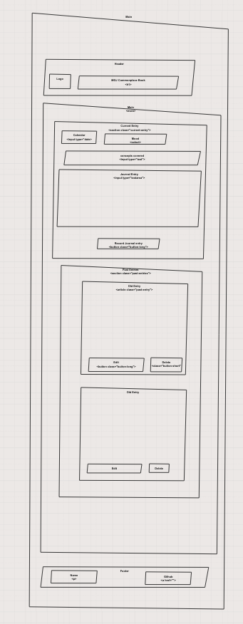

# Daily Journal

This is a personal learning project. You can find the instructions that I worked through on this project here: [Link to instructions](https://github.com/nashville-software-school/client-side-mastery/blob/master/book-1-martins-aquarium/chapters/DAILY_JOURNAL_WIREFRAME.md). Although there is example code in these instructions, I wrote to majority of the code from scratch.

The learning goals for this project were 

1. HTML, CSS and Javascript syntax
1. Rendering data to the DOM
1. Custom events
1. Using json-server to locally simulate an API
1. Structuring code into components with minimal coupling
1. Data structures
1. HTTP methods
1. CRUD functionality 

One additional component that I built for this project was the character counter. It was a great opportunity to break away from the instructions and write something on my own. I was especially happy that I was able to write it as an independent component that can be invoked by other components.

I also completed an optional challenge for this project, which was to create a tagging system for this site. The tagging system is an exercise in many-to-many relationships. 

## Site Screenshot

## Page Wireframe

## Try it out for yourself!

Setup:
1. Clone the repo locally
1. Use the npm command `serve` to serve the index.html
1. Open a new terminal window, and navigate to the api folder. Serve entries.json using `json-server -w entries.json`
1. Open the page `http://localhost:5000/` in Chrome
1. Try creating a new entry, editing the entry, and deleting the entry!